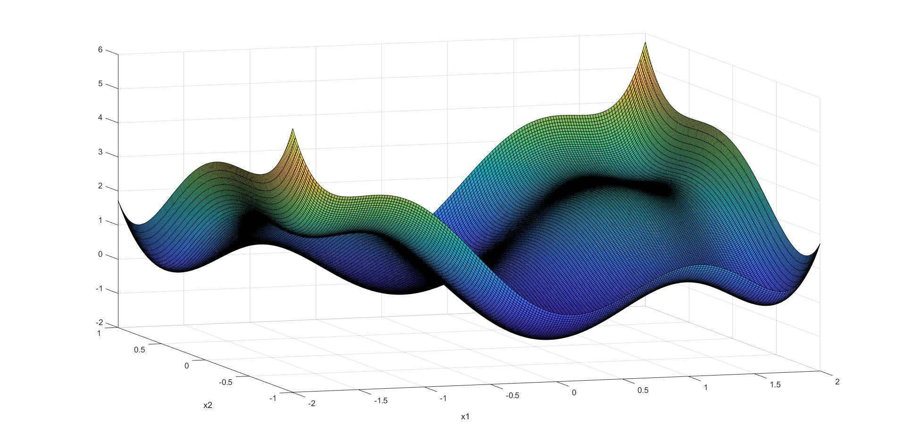

# Implementation of a Feedforward neural network using numpy
### Project for "Optimization Methods for Machine Learning" @LaSapienza university of Rome
  
Goal: Reconstructing a two dimensional function from a dataset of 300 observations using MLP and RBF networks

Code: python, numpy, scipy

Authors: Francesco Russo, Michele Cernigliaro

